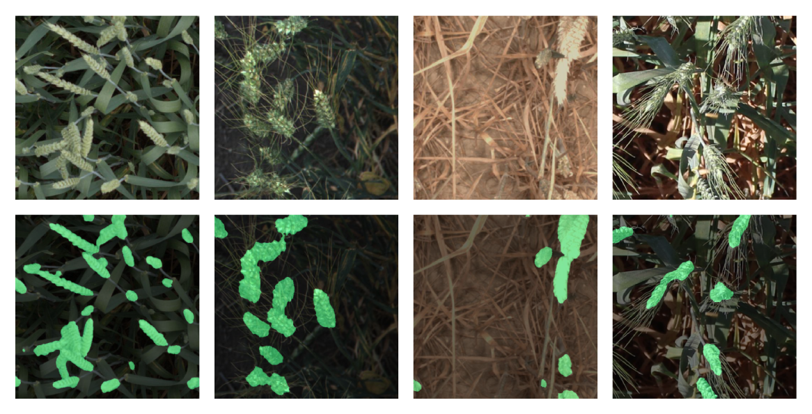

# 🌾 HeadCount

A semantic segmentation model for counting wheat heads in field images. Designed for yield estimation, flowering time detection, and field maturity assessment.

**[Interactive Demo →](https://huggingface.co/spaces/chmcbs/HeadCount)**

**[Model Card →](https://huggingface.co/chmcbs/HeadCount)**



## ℹ️ About

Manual wheat head counting is time-consuming and impractical at scale. Traditional computer vision methods struggle with overlapping heads and varying lighting conditions. HeadCount is a fine-tuned deep learning model trained to segment wheat heads from other organs, enabling automated, accurate counting from field images.

## 📁 Project Structure

```
HeadCount/
├── inference.py              # Main inference module
├── demo.py                   # Local Gradio demo
├── app.py                    # HuggingFace Spaces app
├── 01_eda.ipynb              # Exploratory data analysis
├── 02_data_prep.ipynb        # Data preparation
├── 03_training.ipynb         # Model training
├── 04_evaluation.ipynb       # Model evaluation
├── 05_head_counting.ipynb    # Head counting analysis
├── cache/                    # Model checkpoints
└── validation/               # Validation images and overlays
```

## 💻 Example Usage

```python
from inference import GWFSSModel
from PIL import Image

# Load model
model = GWFSSModel("model.pth")

# Load and process image
image = Image.open("input.jpg")
predictions = model.predict(image)

# Count heads
num_heads = model.count_heads(predictions)
print(f"🌾 {num_heads} heads detected")

# Create visualisation
overlay = model.overlay_mask(image, predictions, alpha=0.5, heads_only=True)
overlay.save("output.png")
```

## ⚠️ Limitations

Best performance is achieved with overhead imagery under diffuse lighting. Known challenges include:
- **Lighting Sensitivity:** Bright or harsh lighting can cause over-segmentation, splitting single heads into multiple detections
- **Overlapping Heads:** Dense clusters with significant overlap are challenging to separate accurately
- **Colour Dependency:** Performance is lower on senesced plants

## Training Data

The model is trained on [`GWFSS_v1.0_labelled`](https://huggingface.co/datasets/GlobalWheat/GWFSS_v1.0) from the [Global Wheat Full Semantic Organ Segmentation](https://doi.org/10.1016/j.plaphe.2025.100084) dataset.

## License

This project is licensed under the MIT License - see the [LICENSE](LICENSE.txt) file for details.